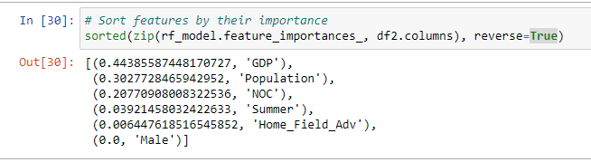

# Olympic_Medal_Predictor
Data and configurations:

$ git clone --branch paul git@github.com:Owen-Doc/Olympic_Medal_Predictor.git

Main dataset: https://www.kaggle.com/heesoo37/120-years-of-olympic-history-athletes-and-results  [athlete_events.csv.zip](https://github.com/Owen-Doc/Olympic_Medal_Predictor/tree/main/Resources/athlete_events.csv.zip) 
using data here to update the dataset for the 2022 olympics https://github.com/rgriff23/Olympic_history

May pull (additional) data from http://www.olympedia.org/ in order to get the last winter Olympics data included in the dataset and any additional suspensions that would have caused an athlete to be removed from Medals Standings. Also of note Junior Olympics data is in that dataset 

Ineligible athletes list from https://www.athleticsintegrity.org/disciplinary-process/global-list-of-ineligible-persons
tool to convert PDF to excel https://simplypdf.com/Excel to[May-2021-Sanctions-List-Full.xlsx](https://github.com/Owen-Doc/Olympic_Medal_Predictor/tree/main/Resources/May-2021-Sanctions-List-Full.xlsx) 

GPS coordinates for host city locations? https://en.wikipedia.org/wiki/List_of_Olympic_Games_host_cities

Athletics Abbreviation? https://en.wikipedia.org/wiki/Athletics_abbreviations

- Topic

1. A machine learning model to predict 2021 Olympic medal counts for different countries, with a consideration for doping status/history using data from 1900 back.
2. One of the challenges is merging the doping history with the Olympic performance data – when an athlete is found guilty, they are removed from the medal data.
3. Home field advantage question?
4. Favorite sports by country?
5. On the dataset, make sure we specify that the medal column is converted from “NA” to “No Medal”

- Tools

1. Python tools to scrape data, beautiful Soup

2. Tableau for Heat maps weigh medal winners/counts vs home field advantage?

3. Statistics: need to look into position or possible time results for races?

   

Added machine learning models

Added resource SanctionedAthletes.xlsx

 [drug_use_forest.ipynb](drug_use_forest.ipynb)  and revised with 

 [drug_use_forest-modified.ipynb](drug_use_forest-modified.ipynb) 

adding in dataset https://www.imf.org/-/media/Files/Publications/WEO/WEO-Database/2021/WEOApr2021all.ashx to our clean athlete dataset to retrieve population, employment + unemployment data and GDP in current USD prices.

main github paged updated : https://github.com/Owen-Doc/Olympic_Medal_Predictor

sample database query provided here: [queries.sql](queries.sql) 

Added in GDP and population data to run some preliminary data, added chart to google docs

https://docs.google.com/presentation/d/13BkwpaAfonPbkYUwHNgPaWav6qAYV6PfYI1Y0RyVfMI/edit#slide=id.gc6f73a04f_0_0

We potentially find that GDP and Population factor in medal counts, as such that shows the rise in countries like China in recent years where they had a push in GPD 

with accuracy of 80%

The precision of the model using Sport and Event was  7% more accurate 

and hard a larger weight in importance

